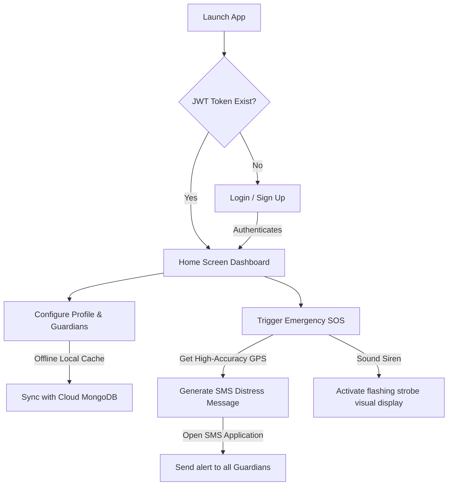

# Shtree Kavach - Project Documentation

**Shtree Kavach** is a premium, offline-first women's safety mobile application designed to provide immediate assistance and security networks during emergency situations. It features a modern, dark-themed user interface that works seamlessly offline and coordinates automatically with a backend server when network connectivity is available.

---

## 1. Key Features & Capabilities

*   **SOS & Emergency Triggers**: Core safety button that triggers emergency contact messaging. The app retrieves high-accuracy GPS coordinates and packages them into an emergency SMS alert sent directly to the user's guardians.
*   **Background Shake Detection**: Monitors physical accelerometer forces. A simple physical shake of the device automatically triggers the SOS protocol, even if the user is unable to open or look at the screen.
*   **Fake Call Simulation**: Simulates a realistic incoming phone call interface accompanied by a loopable ringtone to help users safely and politely excuse themselves from uncomfortable or threatening situations.
*   **Siren & Strobe Light**: Plays a loud alert siren on loop accompanied by flashing visual strobe panels to attract immediate public attention and deter potential threats.
*   **Police Maps Integration**: Detects the user's current GPS location and automatically routes them to the nearest police stations on Google Maps.
*   **Guardian Network Sync**: Allows users to manage their list of trusted contacts. These contacts are cached locally for offline reliability and synced securely with the cloud database.

---

## 2. System Workflow

The user journey in Shtree Kavach follows a clean and secure workflow from onboarding to emergency management:



### Flow Breakdown
1.  **Onboarding & Access**: When the app starts, it checks if a valid login token is cached on the device. If not, it guides the user through the traditional email/password Sign Up and Login screens.
2.  **Profile & Settings Configuration**: Once logged in, the user can set up their personal details (Name, Age, Phone, Aadhaar), write a custom distress message template, choose their accelerometer shake sensitivity (Low, Medium, High), and manage guardian contacts.
3.  **Local to Cloud Sync (Offline-First)**: Profile details and guardian numbers are saved instantly to the local disk (`SharedPreferences`). A background process syncs this data with the remote API database. If the user is offline, the app uses cached data and syncs automatically when the connection is restored.
4.  **SOS Dispatch Flow**: When an emergency trigger occurs (via shake or SOS button), the app fetches the location coordinates, builds a Google Maps URL, combines it with the distress message, and auto-loads the SMS dialer with all guardian numbers pre-populated.

---

## 3. How to Use the App

### 1. Registering & Logging In
*   Open the app and click **Sign Up** to create an account with your email and a secure password.
*   Log in using your registered credentials. The app will securely save your session, meaning you won't need to log in again on subsequent launches.

### 2. Setting up Guardians
*   Navigate to the **Contacts** tab from the bottom navigation bar.
*   Click **Add Contact** to enter names and phone numbers of trusted family members or friends.
*   Save the changes. The app will cache them locally and sync them to your account on the server.

### 3. Activating Emergency SOS
*   **Using the Screen**: Press and hold the glowing pink **Radar SOS** button on the home screen.
*   **Using Device Shake**: Shake your phone firmly. The accelerometer will detect this movement and launch the SOS workflow. (You can enable/disable this feature and customize the shake force required under the **Profile** tab settings).

### 4. Escaping Uncomfortable Situations
*   **Fake Call**: Tap **Fake Call** in the Emergency Quick Panel. A simulated incoming call screen will launch with options to answer or decline while playing a realistic ringtone.
*   **Siren & Strobe**: Tap **Siren & Strobe** to sound a loud alarm and flash the screen colors rapidly. Tap the screen to dismiss.
*   **Police Maps**: Tap **Police Maps** to find and route to the nearest police stations instantly.

---

## 4. Setup & Installation Guide

### Mobile App Setup (Flutter)
1.  Verify that you have Flutter SDK installed (`flutter --version`).
2.  Download application dependencies:
    ```bash
    flutter pub get
    ```
3.  Set your backend URL endpoint in `lib/services/api_service.dart`:
    ```dart
    static const String baseUrl = 'http://localhost:5000/api'; // Or your hosted backend domain
    ```
4.  Run the application on a connected device/emulator:
    ```bash
    flutter run
    ```

### Backend Setup (Node.js & Express)
1.  Navigate to the `/backend` directory.
2.  Install packages:
    ```bash
    npm install
    ```
3.  Create a `.env` file in the backend root directory:
    ```env
    PORT=5000
    MONGO_URI=mongodb://127.0.0.1:27017/safeher
    JWT_SECRET=SafeHerSuperSecretJWTKey123
    ```
4.  Launch the Node server:
    ```bash
    npm start
    ```
